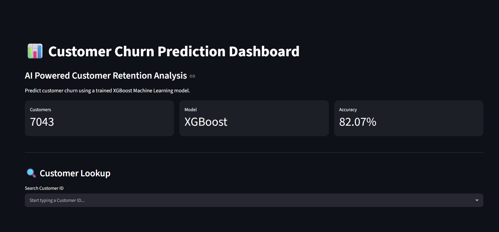
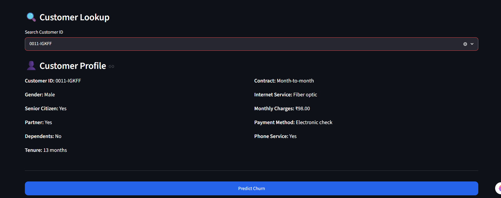
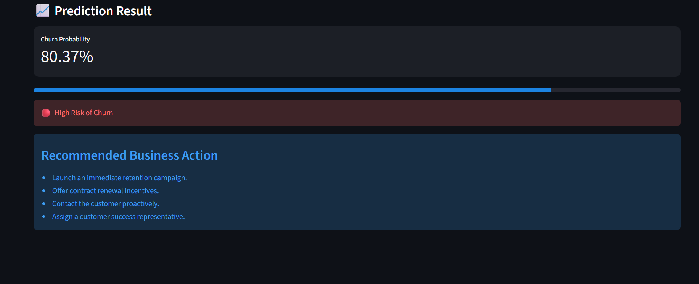

# 📊 Customer Churn Prediction Dashboard

An end-to-end Machine Learning application that predicts customer churn using an optimized XGBoost model. The project includes data preprocessing, exploratory data analysis, model training, hyperparameter tuning, MySQL integration, and an interactive Streamlit dashboard.

---

## 🚀 Features

- Interactive Streamlit Dashboard
- Customer Search using Customer ID
- Churn Prediction using XGBoost
- Churn Probability Score
- Low / Medium / High Risk Classification
- Business Recommendations
- MySQL Database Integration
- Responsive Dashboard UI

---

## 📂 Dataset

- Telco Customer Churn Dataset
- Total Customers: **7043**
- Training Samples: **7032**
- Target Variable: **Churn**

---

## 🛠️ Tech Stack

### Programming

- Python

### Libraries

- Pandas
- NumPy
- Scikit-learn
- XGBoost
- Streamlit
- SQLAlchemy
- PyMySQL
- Joblib

### Database

- MySQL

---

## 📊 Machine Learning Pipeline

- Data Cleaning
- Missing Value Handling
- Exploratory Data Analysis (EDA)
- Feature Engineering
- One-Hot Encoding
- Train-Test Split
- Model Training
- Hyperparameter Tuning using RandomizedSearchCV
- Model Evaluation
- Model Deployment

---

## 📈 Model Performance

| Metric | Score |
|---------|------:|
| Accuracy | **82.07%** |
| Algorithm | XGBoost |
| Hyperparameter Tuning | RandomizedSearchCV |

---

## 🗄️ MySQL Integration

The application stores customer information in MySQL.

Two tables are used:

- customers
- processed_customers

The Streamlit application fetches customer information directly from MySQL and performs predictions using the trained XGBoost model.

---

## 💻 Installation

Clone the repository

```bash
git clone https://github.com/Saqib-0007/customer-churn-prediction.git
```

Move into the project directory

```bash
cd customer-churn-prediction
```

Install dependencies

```bash
pip install -r requirements.txt
```

---

## ▶️ Run the Application

```bash
streamlit run app.py
```

---

## 📁 Project Structure

```text
customer-churn-prediction/
│
├── app.py
├── styles.css
├── requirements.txt
├── README.md
│
├── assets/
├── data/
├── database/
├── model/
├── notebooks/
└── scripts/
```

---

# 📸 Application Screenshots

## Dashboard

The application dashboard provides an overview of the project, model details, and customer search functionality.



---

## Customer Lookup

Users can search for a customer using the Customer ID to view their profile.



---

## Prediction Result

The dashboard predicts the customer's churn probability, displays the risk level, and suggests business recommendations.



---

## 🔮 Future Improvements

- User Login Authentication
- Real-Time Predictions
- Cloud Database Integration
- Docker Deployment
- Model Monitoring
- Automated Model Retraining

---

## 👨‍💻 Author

**Saqib Ahmad Khan**

GitHub:
https://github.com/Saqib-0007

LinkedIn:
https://www.linkedin.com/in/saqib-khan-11aba2309/
